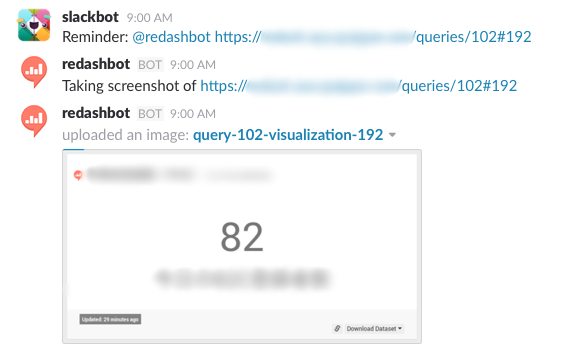

# Slack Bot for re:dash

This is slack bot for [re:dash](https://redash.io).

## Features

- Take a screen capture of visualization
  - Bot can handle message format like `@botname <visualization URL>`
    - example: `@redashbot https://your-redash-server.example.com/queries/1#2`



## How to develop

Clone this repository, then

```bash
$ npm install
$ export REDASH_HOST=https://your-redash-server.example.com
$ export REDASH_API_KEY=your-redash-api-key
$ export SLACK_BOT_TOKEN=your-slack-bot-token
$ node index.js
```

## How to deploy to Heroku

You can easy to deploy redashbot to Heroku, just click following button.

[](https://heroku.com/deploy)
